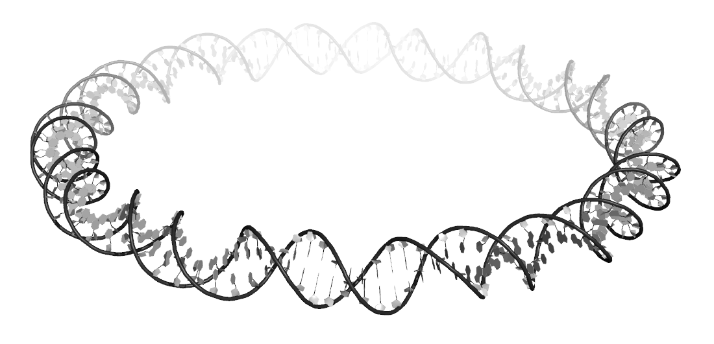

# circDNA
This repository holds a Python3 script and examples used to generate a circular fragment model of DNA.

---

## Question: What makes it a "circle"?

A circular model of DNA is defined as being "covalently closed". 

DNA has two antiparallel chains: the 'coding' strand and the 'complementary' or 'anti-coding' strand. Both strands are read from the 5' to 3' direction, where the prime-notation refers to the carbon atoms on the deoxyribose sugars that are attached to phosphate groups along the chains.

---

## Getting Started

* This work is done in a terminal or command line application.  *
- *Downloading*: Download the Python3 script located in the `circle_generator_script` directory. 
    - You can make a single copy in one standard directory or make multiple copies and place them in directories as you need them. 
    - In order to use this script, you must have the following modules locally downloaded: `os`, `argparse`, `numpy`, `scipy`. You can also use the `circdna.yml` conda environment file with all packages ready for you to install on your own local Conda environment.
    - For instructions, visit https://conda.io/projects/conda/en/latest/user-guide/tasks/manage-environments.html#activating-an-environment
        - From the (base) conda environment: 
            - `conda env create -f circdna.yml`
            - **NOTE** For standardization, NEVER update this environment unless stated in this repo. This build specifically uses Python3 3.10 (as of 26 Jun 2024).

- *Execution*: From within your desired directory, open a terminal and execute the script. 
*Note: if you are planning on using the `circdna` conda environment, make sure to activate it now:* `$ conda activate circdna`
CLI commands & flags: 
    - long:      `$ python3 planar_circle_generator.py --length ... --rise ... --bp-per-turn ... --seq ... --output-name ...`
    - shortened: `$ python3 planar_circle_generator.py -l ... -r ... -t ... -s ... -o ...`
    - *note* not all commands are required. The `seq`, `rise`, and `bp-per-turn` flags default to all dA residues, 3.400-$\AA$, and 10.5-bp/turn, respectively. 
For example: `$ python3 planar_circle_generator.py --length 100 --output-name test_circ`

- *File conversion*: You may note the files produced have a .par file extension. You can use an online web server to generate an all-atom .pdf file.
    - Visit http://web.x3dna.org/
    - Select the 'Rebuilding' tab at top.
    - Select the 'Customized base-pair step/nucleotide parameters' blue button.
    - Look for text "**Upload a base-pair parameter file**" found under a grayed-out text input box. Select the "Choose File" button and locate/upload your .par file.
    - Deselect the "Backbone geometry optimization" radial button found to the right of the blue "Build Model" button.
    - Select the "Build Model" button.
    - Under the top 2D image select the "Download the rebuild PDB file" hyperlink.
    - (*optional*) Locate this downloaded file and rename/move as needed.

- *Result*:
Below should be a 100-bp planar circle generated from the web3DNA server.

Congrats! Now you can make more circles as needed. You can customize using software such as emDNA[https://nicocvn.github.io/emDNA/].

---

## Common Software used
The software and web servers used includes:
- Python3.X
- Jupyter Notebooks
- PyMol 2.X
- 3DNA[http://web.x3DNA.org]
- emDNA[https://nicocvn.github.io/emDNA/]

---

## Reference
If you are interested in additional detail, you may read over the 'Appendix' of my Physics Masters Thesis (Rutgers University, Jan 2022) found in the `assets` directory.

---

